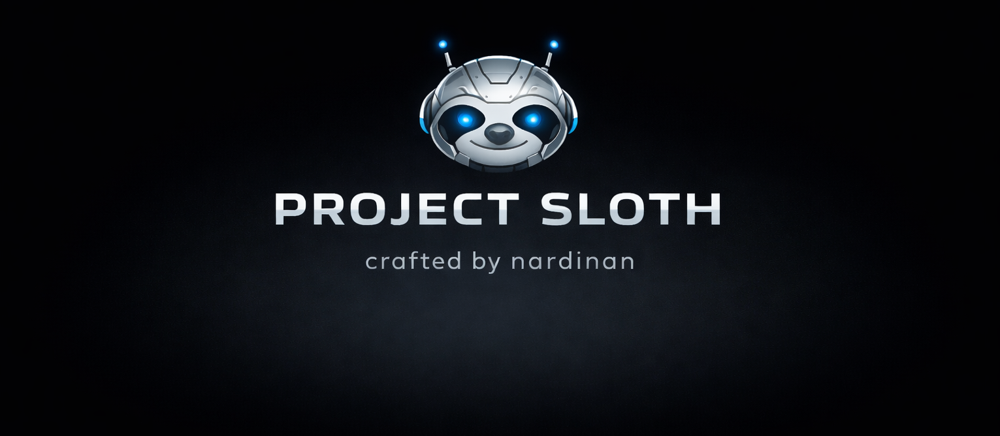

**sloth** is a small educational LLM written entirely from scratch in pure C, with no non-unix dependencies.

The goal of the project is not raw speed, scale, or production readiness. The goal is to **understand how a transformer-based language model actually works**, end to end, by implementing the core mechanisms manually and documenting them heavily in the source code (not necessarily in the most efficient way).

If you want to follow a minimal but fairly complete implementation of a GPT-style model (including embeddings, positional encoding,self-attention, feedforward layers, backpropagation) this project is for you.

The code is intentionally verbose and heavily commented so you can follow the logic **function by function**.

## Philosophy

`sloth` is meant to be:

- **educational**
- **readable**
- **hackable**
- **dependency-light**
- **Unix-friendly**

This is not a highly optimized training system, and it is not trying to compete with existing frameworks. It is a project for learning, experimentation, and understanding the internals of LLMs by building them yourself.

## Build

If you want to squeeze as much speed as possible out of this implementation, compile it with:

```bash
gcc -O3 -march=native llm.c -lm -o llm
```

## Data

The tokenizer is deliberately tiny. It reserves a few special tokens:

- `0`: padding
- `1`: beginning of sequence
- `2`: end of sequence
- `3`: system block
- `4`: user block
- `5`: assistant block
- `6..100`: printable ASCII characters from space through `~`

For plain pre-training, use a normal text corpus made of printable ASCII characters. Non-printable characters are ignored by the encoder, so keep the corpus simple: use spaces instead of tabs or embedded newlines if you want predictable next-character training.

For supervised fine-tuning, the file format is line-based:

```text
S:system message
U:user message
A:assistant answer

U:another user message
A:another assistant answer
```

The first character selects the block type:

- `S:` inserts a system-block token and uses the rest of the line as system text.
- `U:` inserts a user-block token and uses the rest of the line as user text.
- `A:` inserts an assistant-block token and uses the rest of the line as assistant text.

Blank lines end the current sequence and insert an end-of-sequence token. The next non-blank block starts a new sequence and gets a beginning-of-sequence token.

Only the text after `A:` is used as a training target during SFT. System and user text are context only. The special block tokens themselves are also masked out of the loss.

The parser does not trim whitespace: `U: hello` includes the leading space before `hello`, while `U:hello` does not.

## Pre-training

Pre-training starts from a new random model when the model file does not exist. If the checkpoint already exists, training resumes from it.

```bash
./llm t <corpus.txt> <model.checkpoint> [epochs]
```

Example:

```bash
./llm t data/pretrain.txt checkpoints/pretrained.sloth 5
```

The model checkpoint is saved after every training step. The whole corpus is loaded into memory and processed in chunks of `512` tokens.

## Supervised Fine-tuning

Supervised fine-tuning loads a pre-trained checkpoint and writes a separate fine-tuned checkpoint:

```bash
./llm f <sft.txt> <pretrained.checkpoint> <sft.checkpoint> [epochs]
```

Example:

```bash
./llm f data/sft.txt checkpoints/pretrained.sloth checkpoints/sft.sloth 3
```

SFT uses a lower learning rate than pre-training. It starts from the source checkpoint each time and resets the optimizer step counter for the fine-tuning run, so rerunning the command is not currently a resume operation for the destination checkpoint.

This README.md has been written by chatGPT. Apologies.
